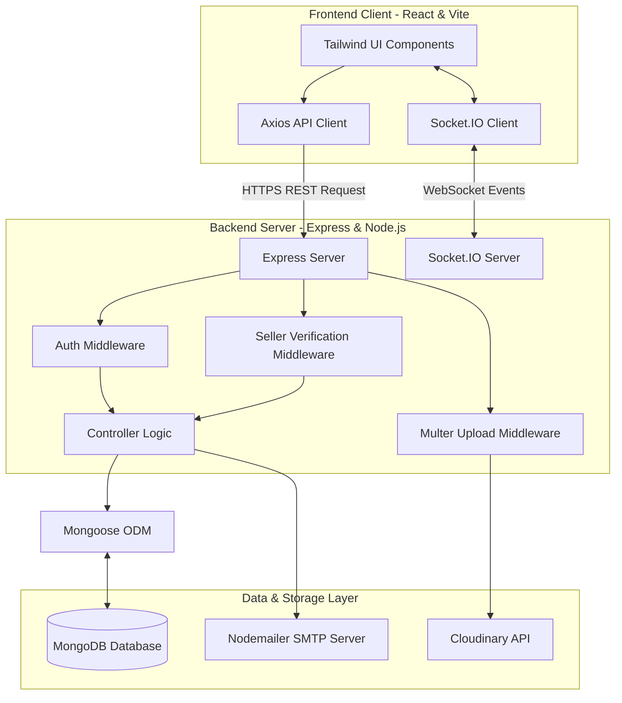
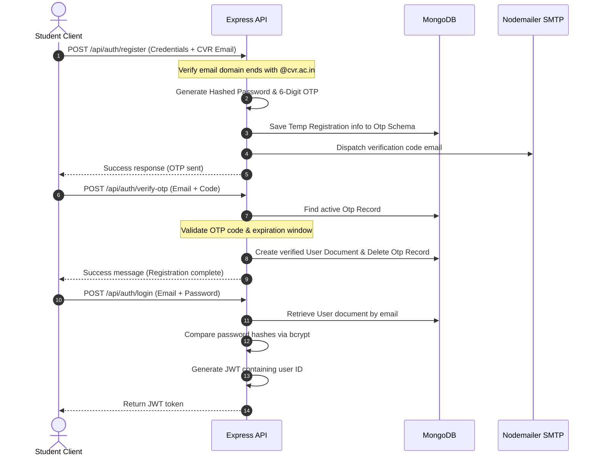

# Campus OLX

Campus OLX is a secure, college-exclusive online marketplace designed for student-to-student transactions of semester-specific academic resources. The platform allows verified students to list, browse, search, and exchange academic items such as textbooks, calculators, engineering drafters, lab coats, and other essentials within their campus community.

---

## 1. Project Overview

Campus OLX addresses the friction of peer-to-peer commerce in university environments. In a typical academic cycle, students purchase materials that are only needed for a single semester. Once the semester ends, these assets gather dust, while the incoming cohort of junior students pays full price for the same items. 

By restricting registration to verified institutional emails, Campus OLX provides a trusted, closed-loop environment where students can securely buy and sell items directly on campus. This peer-to-peer exchange reduces academic expenses, promotes sustainability, and eliminates the safety concerns and logistics overhead associated with public marketplaces.

---

## 2. Problem Statement

* **Temporary Resource Utility:** Academic resources (textbooks, calculators, lab equipment) are expensive and often utilized for only a 4-to-5-month semester.
* **Economic Inefficiency:** Sellers have no efficient way to liquidate their unused academic assets, while buyers struggle to find affordable, pre-owned alternatives.
* **Unstructured Informal Channels:** Existing workarounds, such as unofficial WhatsApp groups or bulletin boards, are unstructured, unsearchable, and lack transactional security or user verification.
* **Lack of Trust & Verification:** Open marketplaces present safety risks and logistical hurdles, requiring a verified, campus-only user directory to guarantee trust.

---

## 3. Key Features

* **Verified Institutional Registration:** Users can only register if they possess an authorized college email domain (specifically configured for `@cvr.ac.in` in the current codebase).
* **Two-Step Email Verification:** Registration inputs are stored in a temporary database while a secure 6-digit OTP is delivered to the student’s college email. Account creation is completed only after successful OTP validation.
* **JWT-Based Authentication:** Standard JSON Web Tokens are generated upon login, persisted on the client browser, and attached to the headers of subsequent requests to protect sensitive routes.
* **Product Listing & Management:** Verified sellers can list items with fields for Title, Description, Price, Category, Semester, and Department, and upload up to 5 images.
* **Cloud-based Image Storage:** Item images are handled using Multer middleware and streamed directly to Cloudinary storage, keeping the application stateless and database sizes light.
* **Targeted Search & Filters:** Buyers can browse items and filter listings by Category, Department, and targeted Semester to find relevant academic resources quickly.
* **Direct Seller Contact & Inbox:** A dedicated messaging gateway connects buyers directly with sellers from the item details page, automatically establishing a chat context.
* **Real-Time Bidirectional Messaging:** Instant messaging is powered by Socket.IO, enabling real-time chat delivery and unread message notifications directly within the client app.
* **Interactive Profile Management:** Users can customize profiles, update contact info (phone, year, section, bio), upload avatar images, and view all items they currently have listed.
* **Seller Authorization Protections:** Strict server-side checks verify listing ownership before permitting edits, removals, or marking items as sold.

---

## 4. Technology Stack

| Layer | Technology | Purpose |
| :--- | :--- | :--- |
| **Frontend** | React (Vite) | Single Page Application (SPA) user interface development |
| **Frontend Router** | React Router DOM | Declarative client-side routing and route guarding |
| **Frontend Styling** | TailwindCSS | Utility-first CSS styling and responsive layout designs |
| **HTTP Client** | Axios | Async HTTP requests, response handling, and header interception |
| **Real-Time Client** | Socket.io-client | Event-driven WebSocket client for instant messaging |
| **Backend Runtime** | Node.js | Server-side runtime environment |
| **Web Framework** | Express.js | REST API routing, controllers, and middleware configuration |
| **Real-Time Server** | Socket.IO | Persistent full-duplex communication and room management |
| **Database** | MongoDB | Document database for highly flexible, document-oriented storage |
| **Object Modeling** | Mongoose ODM | Schema enforcement, data validation, and model relationships |
| **Authentication** | JSON Web Tokens (JWT) | Stateless session authorization tokens |
| **Password Security** | Bcryptjs | Salting and hashing credentials before database storage |
| **File Upload** | Multer | Multipart/form-data middleware for handling file uploads |
| **Media Storage** | Cloudinary | Cloud-based media storage and image optimization API |
| **Email Gateway** | Nodemailer | SMTP client engine for sending registration verification OTPs |

---

## 5. System Architecture



---

## 6. Application Data Flow

1. **User Interaction:** A user interacts with the React frontend (e.g., searches for a textbook, updates a profile, or posts a new item).
2. **API Request (REST):** The client dispatches an HTTP request via Axios. For protected paths, an interceptor automatically appends the user's JWT from `localStorage` into the `Authorization` header as `Bearer <token>`.
3. **Server Route Entry:** The request hits the Express application.
4. **Middleware Processing:** 
   * **Authentication Guard (`authMiddleware.js`):** Checks for the token, verifies it against the server secret, extracts the user ID, and attaches it to `req.user`.
   * **Ownership Guard (`isSeller.js`):** Intercepts modifications on specific items, checks MongoDB to verify that `req.user` matches the item's `seller` ID, and loads the item into `req.item` if valid.
   * **File Processing (`uploadMiddleware.js`):** Uploads incoming images directly to Cloudinary and passes the resulting image URLs inside the request object.
5. **Controller Execution:** The matching controller retrieves the parsed inputs, validates them, and queries the database via Mongoose models.
6. **Mongoose Transactions:** Documents are fetched, updated, or inserted inside MongoDB.
7. **JSON Response Transmission:** The backend responds with a JSON payload and HTTP status code.
8. **UI State Update:** The React frontend receives the response, updates the React context/state variables, and re-renders the UI to display the new data.

---

## 7. Authentication and Authorization

### User Verification and Login Flow



### Key Security Implementations:
* **Stateless Token validation:** Routes requiring verification are wrapped in the `protect` middleware. The token must be sent in the `Authorization: Bearer <token>` header.
* **Granular Owner Access:** To protect listings, the server applies `isSeller` middleware before any update, deletion, or transaction-state changes. This ensures that only the listing seller can modify their item's parameters.

---

## 8. Real-Time Chat Architecture

Real-time chat is decoupled from the typical request-response API flow by establishing a persistent full-duplex WebSocket connection.

### WebSocket Connection Management:
1. **Instantiation:** On application load, if a token is present, the frontend connects to the Socket.IO server utilizing the server's root URL.
2. **Registration (`registerUser`):** Once authenticated, the frontend emits a `registerUser` event passing the user's database ID. The server puts this socket instance into a private room named `user_<userId>` to receive targeted unread message notifications.
3. **Room Association (`joinChat`):** When a user clicks a chat, they emit `joinChat` passing the specific `chatId`. The server maps the socket to a room identifier matching the `chatId`.
4. **Message Transmission (`sendMessage`):** When a message is sent, the client emits `sendMessage` with the payload:
   ```json
   {
     "chatId": "...",
     "content": "...",
     "token": "JWT..."
   }
   ```
5. **Server Verification & Persistence:** The server catches `sendMessage`, decrypts the JWT within the payload to extract the sender's identity, saves the new message to MongoDB, and updates the parent Chat document's `latestMessage`.
6. **Broadcasting (`receiveMessage`):** The server broadcasts the populated message object back to all clients connected to the `chatId` room.
7. **Unread Notifications (`newMessageNotification`):** If a user is online but not currently active in that specific chat room, the server emits a `newMessageNotification` to the participant's specific user room (`user_<recipientId>`), triggering an increment to their unread notification badge.

---

## 9. Database Design

```mermaid
erDiagram
    User ||--o{ Item : "registers & sells"
    User ||--o{ Chat : "participates in"
    User ||--o{ Message : "sends"
    
    Item ||--o{ Chat : "corresponds to"
    
    Chat ||--o{ Message : "contains"
    Chat |o--|| Message : "has latestMessage"
    
    User {
        ObjectId id PK
        String name
        String email UK
        String password
        String department
        String bio
        String avatarUrl
        Boolean isVerified
        String phone
        String year
        String section
        Date createdAt
        Date updatedAt
    }

    Item {
        ObjectId id PK
        String title
        String description
        Number price
        String category
        String semester
        String department
        String array images
        ObjectId seller FK
        String status
        Date createdAt
        Date updatedAt
    }

    Chat {
        ObjectId id PK
        ObjectId item FK
        ObjectId array users FK
        ObjectId latestMessage FK
        Date createdAt
        Date updatedAt
    }

    Message {
        ObjectId id PK
        ObjectId chatId FK
        ObjectId sender FK
        String content
        Date createdAt
        Date updatedAt
    }

    Otp {
        ObjectId id PK
        String email UK
        String otp
        Date expiresAt
        String name
        String hashedPassword
        String department
    }
```

### Schema Model Definitions

#### 1. User
Stores member profiles.
* **Fields:** `name`, `email` (unique), `password`, `department`, `bio`, `avatarUrl`, `isVerified` (default: false), `phone`, `year`, `section`.
* **Timestamps:** Automatic creation and modification tracking.

#### 2. Item
Contains listings posted by sellers.
* **Fields:** `title`, `description`, `price`, `category`, `semester`, `department`, `images` (string array of Cloudinary URLs), `seller` (ObjectId, ref: 'User'), `status` (enum: `["active", "sold", "removed"]`, default: `active`).

#### 3. Chat
Acts as a session directory connecting buyers, sellers, and items.
* **Fields:** `item` (ObjectId, ref: 'Item', required), `users` (Array of ObjectIds, ref: 'User'), `latestMessage` (ObjectId, ref: 'Message').

#### 4. Message
Persists chat messages.
* **Fields:** `chatId` (ObjectId, ref: 'Chat', required), `sender` (ObjectId, ref: 'User', required), `content` (String, required).

#### 5. Otp
Handles temporary user registration records pending email verification.
* **Fields:** `email`, `otp`, `expiresAt` (has TTL index set to auto-expire documents on expiration), `name`, `hashedPassword`, `department`.

---

## 10. API Documentation

### Authentication Endpoints
All endpoints are prefix-routed on `/api/auth`.

| Method | Endpoint | Authentication Required | Description |
| :--- | :--- | :--- | :--- |
| `POST` | `/register` | No | Creates a temporary registration record in the `Otp` schema and dispatches a 6-digit verification code to the target email. |
| `POST` | `/verify-otp` | No | Validates the OTP. On validation, the user profile is written to the `User` schema and the OTP record is purged. |
| `POST` | `/resend-otp` | No | Refreshes and re-sends a registration verification code to the requested email. |
| `POST` | `/login` | No | Verifies credentials against the stored user and returns a signed JWT. |

### User Endpoints
All endpoints are prefix-routed on `/api/user`.

| Method | Endpoint | Authentication Required | Description |
| :--- | :--- | :--- | :--- |
| `GET` | `/profile` | Yes | Retrieves the profile details of the currently authenticated user (excluding password). |
| `PUT` | `/profile` | Yes | Updates profile details (name, department, bio, phone, section, year, avatarUrl) for the logged-in user. |
| `GET` | `/:id` | No | Public endpoint to retrieve details of a specific user profile by their ID. |

### Item Endpoints
All endpoints are prefix-routed on `/api/items`.

| Method | Endpoint | Authentication Required | Description |
| :--- | :--- | :--- | :--- |
| `POST` | `/add` | Yes | Creates an item listing. Supports file uploads (up to 5 images) parsed through Multer and sent to Cloudinary. |
| `GET` | `/` | No | Lists active items. Supports filter queries (`semester`, `department`, `category`) and pagination parameters (`page`, `limit`). |
| `GET` | `/my` | Yes | Returns all items registered under the authenticated user. |
| `PUT` | `/sold/:id` | Yes (Seller Only) | Marks a specific item listing status as `"sold"`. |
| `PUT` | `/remove/:id` | Yes (Seller Only) | Marks a specific item listing status as `"removed"`. |
| `PUT` | `/:id` | Yes (Seller Only) | Updates details (title, description, price, category, semester, department) for a listing. |

### Chat Endpoints
All endpoints are prefix-routed on `/api/chats`.

| Method | Endpoint | Authentication Required | Description |
| :--- | :--- | :--- | :--- |
| `GET` | `/` | Yes | Fetches all chat sessions where the logged-in user is a participant. |
| `POST` | `/` | Yes | Locates an existing chat session for an item or instantiates a new one between the buyer and seller. |

### Message Endpoints
All endpoints are prefix-routed on `/api/messages`.

| Method | Endpoint | Authentication Required | Description |
| :--- | :--- | :--- | :--- |
| `GET` | `/:chatId` | Yes | Retrieves all messages stored inside a specific chat conversation, sorted chronologically. |
| `POST` | `/` | Yes | Submits a new message under a conversation and updates the corresponding Chat's `latestMessage`. |

---

## 11. Project Folder Structure

```text
Campus-OLX/
├── backend/
│   ├── config/
│   │   └── cloudinary.js           # Cloudinary SDK credentials configuration
│   ├── controllers/
│   │   ├── authController.js       # Handles sign-up, verification, and logins
│   │   ├── itemController.js       # Manages item CRUD, filters, and uploads
│   │   └── userController.js       # Profiles fetch and updates
│   ├── middleware/
│   │   ├── authMiddleware.js       # Verifies JWT validation
│   │   ├── isSeller.js             # Validates listing ownership
│   │   └── uploadMiddleware.js     # Configures Multer storage mapping
│   ├── models/
│   │   ├── Chat.js                 # Chat model schema
│   │   ├── Item.js                 # Item model schema
│   │   ├── message.js              # Message model schema
│   │   ├── Otp.js                  # Temp verification model schema
│   │   └── user.js                 # User profile schema
│   ├── routes/
│   │   ├── authRoutes.js           # Auth route declarations
│   │   ├── chatRoutes.js           # Chat route declarations
│   │   ├── itemRoutes.js           # Item route declarations
│   │   ├── messageRoutes.js        # Message route declarations
│   │   └── userRoutes.js           # Profile route declarations
│   ├── utils/
│   │   └── sendEmail.js            # Nodemailer transport definition
│   ├── server.js                   # Server bootstrapper, routing mounts, and Socket.IO initialization
│   └── package.json                # Node script configurations and dependencies
│
├── campus-olx-frontend/
│   ├── public/
│   ├── src/
│   │   ├── components/
│   │   │   ├── Button.jsx          # Reusable customized buttons
│   │   │   ├── Footer.jsx          # Standard page footer
│   │   │   ├── ItemCard.jsx        # Grid card visualization for items
│   │   │   ├── ItemSkeleton.jsx    # Shimmer loader for lazy content
│   │   │   ├── Loader.jsx          # Spinner loader component
│   │   │   ├── Modal.jsx           # Clean confirmation modals
│   │   │   ├── Navbar.jsx          # Responsive header navigation
│   │   │   └── ProtectedRoute.jsx  # Route guard wrapper checking AuthContext
│   │   ├── context/
│   │   │   ├── AuthContext.jsx     # Handles user auth states, profiles, and tokens
│   │   │   ├── ChatContext.jsx     # Manages notifications, unread badges, and socket listening
│   │   │   └── ThemeContext.jsx    # Light and Dark theme configurations
│   │   ├── pages/
│   │   │   ├── AddItem.jsx         # Form to create new item listings
│   │   │   ├── Chat.jsx            # Dynamic messaging window
│   │   │   ├── ChatInbox.jsx       # Listing page for active user chats
│   │   │   ├── EditItem.jsx        # Form to edit existing listings
│   │   │   ├── ItemDetails.jsx     # Full view of single item listings with seller contact
│   │   │   ├── Landing.jsx         # Clean call-to-action welcome screen
│   │   │   ├── Login.jsx           # User authentication form
│   │   │   ├── Marketplace.jsx     # Core dashboard with filters and search
│   │   │   ├── NotFound.jsx        # 404 page redirect
│   │   │   ├── Profile.jsx         # Profile dashboard and item listing tracker
│   │   │   ├── Register.jsx        # Registration form
│   │   │   └── VerifyEmail.jsx     # Email OTP code input page
│   │   ├── services/
│   │   │   └── api.js              # Centralized Axios setup with request interceptors
│   │   ├── App.css                 # Global stylesheets
│   │   ├── App.jsx                 # App routing declarations
│   │   ├── index.css               # Tailwind CSS integration
│   │   ├── main.jsx                # Application root rendering
│   │   └── socket.js               # Instantiates frontend Socket.IO client
│   ├── tailwind.config.js          # Tailwind theme configurations
│   ├── vite.config.js              # Vite compiler optimizations
│   └── package.json                # Project dependencies and script declarations
└── README.md                       # Current project documentation file
```

---

## 12. Environment Variables

To operate correctly, both the backend and frontend modules must be configured with separate environment variable files. 

### Backend Environment Configuration
Create a `.env` file within the `/backend` directory:

```env
# Server Network Settings
PORT=5555

# MongoDB Connection Configuration
MONGO_URI=mongodb://localhost:27017/your-db-name

# JWT Security Secrets
JWT_SECRET=your_jwt_signing_secret_key

# Cloudinary Integration API Keys
CLOUDINARY_NAME=your_cloudinary_cloud_name
CLOUDINARY_API_KEY=your_cloudinary_api_key
CLOUDINARY_API_SECRET=your_cloudinary_api_secret

# SMTP Email Dispatch Server Credentials
EMAIL_USER=your_nodemailer_gmail_username@gmail.com
EMAIL_PASS=your_gmail_app_password
```

### Frontend Environment Configuration
Create a `.env` file within the `/campus-olx-frontend` directory:

```env
# API Gateway Settings
VITE_API_BASE_URL=http://localhost:5555/api
VITE_SOCKET_URL=http://localhost:5555
```

---

## 13. Local Installation and Setup

Follow these steps to run a copy of the project on your local workstation for development and testing.

### Prerequisites
* **Node.js:** Ensure that Node.js (v18+) is installed.
* **MongoDB:** Ensure that you have a local MongoDB daemon running, or a connection URI to a database server.
* **Cloudinary & Gmail SMTP Accounts:** Required to handle image uploads and OTP delivery.

### Step 1: Clone the Repository
```bash
git clone <repository-url>
cd Campus-OLX
```

### Step 2: Set Up the Backend
1. Open a new terminal and navigate to the backend directory:
   ```bash
   cd backend
   ```
2. Install the backend dependencies:
   ```bash
   npm install
   ```
3. Configure the local environment:
   Create a `.env` file in the `/backend` root directory using the template shown in the [Environment Variables](#12-environment-variables) section.
4. Launch the backend server:
   ```bash
   npm start
   ```
   *The server should report: `Server is running on port 5555` and `MongoDB connected`.*

### Step 3: Set Up the Frontend
1. Open a separate terminal and navigate to the frontend directory:
   ```bash
   cd campus-olx-frontend
   ```
2. Install the client dependencies:
   ```bash
   npm install
   ```
3. Configure the local environment:
   Create a `.env` file in the `/campus-olx-frontend` root directory using the template shown in the [Environment Variables](#12-environment-variables) section.
4. Launch the frontend React app in development mode:
   ```bash
   npm run dev
   ```
5. Open your browser and navigate to `http://localhost:5173`.

---

## 14. How Core Features Work Internally

* **Nodemailer Registration OTP:** When a user posts a registration, the server hashes the input password using Bcryptjs and saves the user metadata inside the temporary `Otp` collection. This document is timestamped and automatically deleted via MongoDB TTL indexes after 10 minutes. The Nodemailer instance uses an SMTP Gmail transporter to dispatch the validation code to the client's email inbox.
* **Cloudinary Direct Stream:** The product listing upload uses Multer. Files are mapped to memory using `multer-storage-cloudinary` and streamed over an HTTP API directly into Cloudinary folders. The API returns unique asset URLs, which are stored in the database.
* **Socket Room Synchronization:** During active chat interactions, rather than polling REST endpoints, Socket.IO matches the active conversational partners into standard rooms named after the corresponding `chatId`. Whenever a client submits a message, the server processes the data, validates the token, writes the message database record, and uses `io.to(chatId).emit(...)` to broadcast the payload to both participants instantly.

---

## 15. Security Considerations

* **Password Cryptography:** User passwords are encrypted using Bcryptjs with a work factor of 10. The system never stores plain-text credentials in the database.
* **Stateless Route Access Control:** Requests to API endpoints requiring authentication must carry a valid JWT. The authentication middleware validates this token and extracts the `req.user` payload.
* **Listing Modification Checks:** Modifying database listings (e.g., updating details, marking as sold, removing) is protected by custom ownership verification middleware, preventing users from altering listings that belong to other sellers.
* **Domain Restrictions:** Account creation is locked strictly to `@cvr.ac.in` domain emails to prevent external sign-ups.
* **Cross-Origin Resource Sharing (CORS):** The backend restrains incoming CORS headers strictly to specified dev clients (`http://localhost:5173`), preventing unauthorized domains from calling application routes.

---

## 16. Technical Design Decisions

* **Separate Frontend & Backend Directories:** Decoupling concerns allows the client UI and the server API to scale independently, keeping compile pipelines clean and making code maintenance easier.
* **MongoDB Document Model:** A database that accommodates nested data models is highly suited to this application's data. Chats, listings, and messages have flexible schema definitions that fit well into JSON-like Mongoose schemas.
* **Socket.IO for Real-Time Exchange:** While REST polling creates network overhead, full-duplex WebSocket connections allow instantaneous communication, giving buyers and sellers an interactive experience similar to standard chat platforms.
* **Stateless JWT Auth:** Using signed JWT tokens eliminates the need for the backend to maintain user sessions in memory, allowing for simple validation on incoming requests.

---

## 17. Future Improvements

* **Advanced Search Options:** Implementing text search indexing with fuzzy-matching search bars to help buyers find listings using partial keywords.
* **Paginated Scrolling:** Implementing infinite scroll queries on the Marketplace page to optimize loading speeds.
* **User Rating & Reviews System:** Building a post-transaction rating mechanism to establish credibility scores for student sellers.
* **Offline Message Badging:** Setting up persistent indicators to store unread flags in the database so users can view unread message counts across sessions.
* **Rate Limiting:** Integrating security layers like `express-rate-limit` to prevent brute-force attacks on OTP generation and authentication endpoints.

---

## 18. Technical Highlights

For reviewers evaluating engineering capabilities:
* **Full-Stack Architecture:** Developed using the MERN stack with clear separation between the client and server.
* **Real-Time Bidirectional Sync:** Implemented full-duplex communication with Socket.IO, featuring room-based message distribution and unread indicators.
* **Multi-Stage Middleware Pipelines:** Leveraged sequential middleware in Express for authentication checks, listing ownership validation, and image upload streaming.
* **Transactional Reliability:** Set up a clean signup workflow with auto-expiring OTP validation using TTL collection indexes.
* **Optimized Storage Handling:** Streamed uploads directly to Cloudinary via Multer memory buffers to keep the database lightweight.
